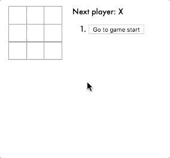
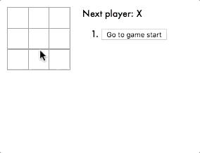

## tic-tac-toe app

This project is based off the reactjs.org tic-tac-toe tutorial found [here](https://reactjs.org/tutorial/tutorial.html)

It can be run by cloning this repository, navigating to its directory, and running the following commands:

```
npm install
```

```
npm start
```

This assumes you have `Node.js` and `npm` installed on your machine. If you haven't done this before, you can visit [nodejs.org](https://nodejs.org/en/download) to get set up.

#### Product after finishing tutorial


#### Extended to show position of each move

