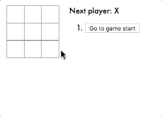
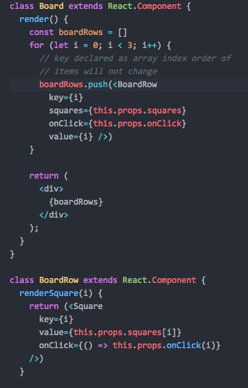
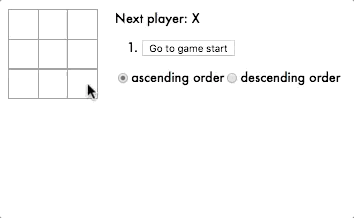
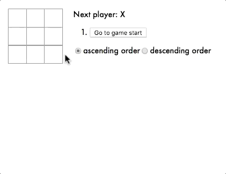

# tic-tac-toe app

This project is based off the reactjs.org tic-tac-toe tutorial found [here](https://reactjs.org/tutorial/tutorial.html)

It can be run by cloning this repository, navigating to its directory, and running the following commands:

```
npm install
```

```
npm start
```

This assumes you have `Node.js` and `npm` installed on your machine. If you haven't done this before, you can visit [nodejs.org](https://nodejs.org/en/download) to get set up.

## Project demonstrations

#### Project after finishing tutorial


#### Extended to show position of each move


#### Extended to bold the currently selected item in the list of moves


#### Extended to render the board via nested `for` loops


#### Extended to change order of list of moves


#### Extended to highlight the winning row


## Discussion
Of the five extensions to the original tutorial, I found the fourth one the most difficult to complete in an elegant way - allowing the moves to be ordered in ascending or descending order.

A variable was added to the state of `Game` to keep track of whether the moves should be displaying ascending or descending. Then, when iterating through the moves, if they should be displayed in descending order, the move was determined by iterating _backwards_ through the `history` array, as follows:

```
const moves = history.map((step, move) => {
  if (!this.state.ascOrder) {
    move = history.length - 1 - move
  }
...
}
```

The final extension, highlighting the winning squares was fairly straightforward to implement. The function `calculateWinner` was altered to return the winning row instead of a Boolean, and the winning row was passed down as props to the `BoardRow` component, where any `Square`s in the winning row are given the class `highlight`.

Since I use [`choo`](https://choo.io) as my preferred Javascript framework, I found this an interesting contrast to the shared state object available in `choo`. Having to explicitly pass `winningRow` as a prop down from `Game` to `Board` to `BoardRow` felt tedious in comparison to just altering a shared state object. I will need to gain some more experience to get a good feel for the pros and cons of different kinds of state modelling.
